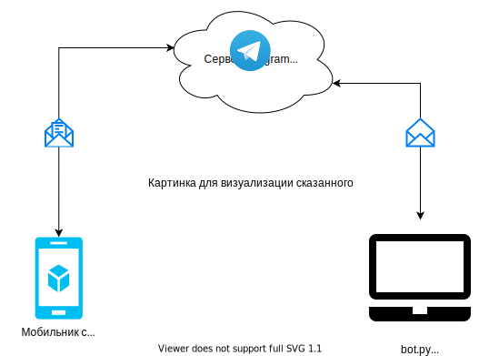
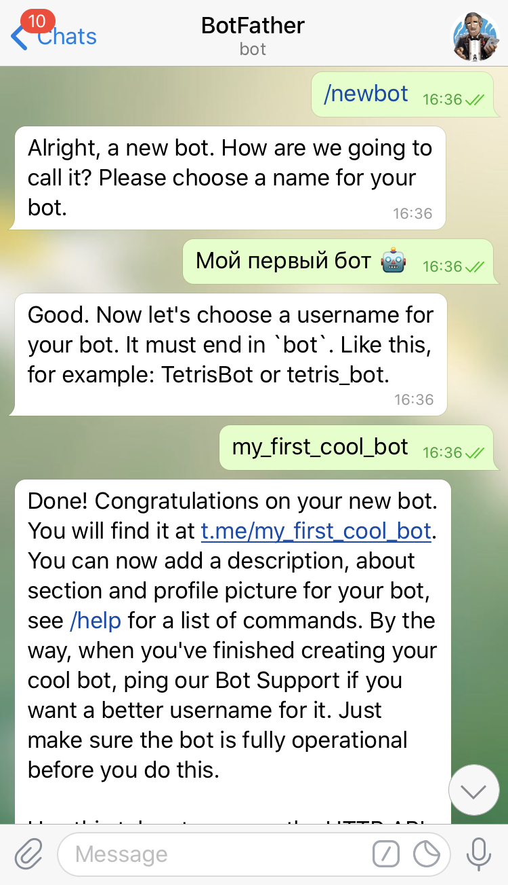
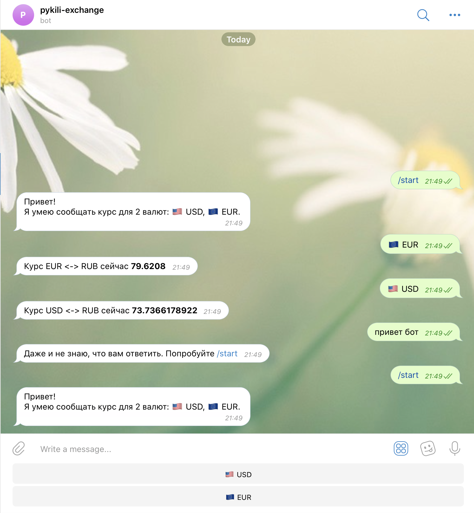
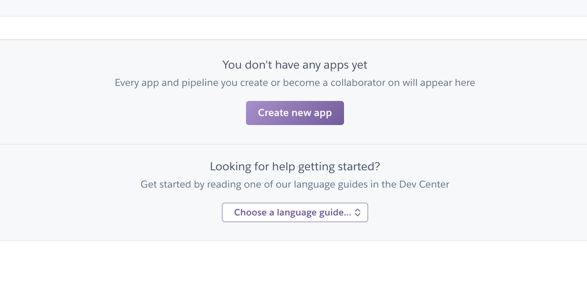

# Как написать своего телеграм бота


## Содержание

todo


## Что такое telegram-бот

Думаю, что вы все пользовались ботами в телеграмме и не хуже меня знаете, что это такое. Но, что представляет из себя бот на самом деле?

Telegram-бот - это программа, написанная на ЛЮБОМ языке программирования, которой можно посылать данные через одно из приложений телеграмм. К сожалению (или счастью), вы не можете посылать сообщения напрямую со своего телефона вашему коду на python. Чтобы все это работало, нужен сервер, который будет вас связывать. На самом деле так работает весь интернет и телеграмм со своими ботами не исключение.



На сайте telegram есть потрясающая документация для разработчиков ботов - <https://core.telegram.org/bots>. Это довольно обширный документ, читая который, можно реализовать любого бота. Однако, делать это с нуля только по документации не такое простое занятие как хотелось бы. Поэтому уже давно существуют библиотеки на python, который ОЧЕНЬ сильно упрощают жизнь создателям ботов.


## Библиотеки для создания ботов

Библиотек довольно много, но мы поговорим здесь о 2 из них:

- [pyTelegramBotAPI](https://github.com/eternnoir/pyTelegramBotAPI)
- [python-telegram-bot](https://github.com/python-telegram-bot/python-telegram-bot)

Эти библиотеки довольно похожи, но мне лично больше нравится `python-telegram-bot`. Она очень качественно написана да и статистика github говорит сама за себя.

На этой библиотеке и ботов написано больше и лайкают её побольше.


Самый простой бот - это тот, который отвечает вам то, что вы ему послали. Такой бот называется **echo-bot**. Давайте его напишем.

Но сначала попросим разрешение у отца всех ботов...


## Получение токена у BotFather

Перед началом программирования бота нужно получить токен для доступа к серверам telegram. Для этого есть специальный бот - **BotFather**. Можете найти его в telegram по этому логину.

Процесс создания бота очень простой. Пишете боту и дальше следуете инструкциям. На скрине все есть:



В сообщении, которое тут скрыто будет токен, с которым вы всегда будете обращаться к серверу telegram. 

Он выглядит примерно следующим образом: `1226478115:AAHwuaJ6i9Sugv6wxqlOLym2H-do3oGli94`. У вас будет свой токен.

А теперь приступим к программированию.


## Создание echo-bot на python-telegram-bot

> Напоминание на всякий случай. Echo-bot - это самый простой учебный бот, который просто отвечает вам то, что вы ему написали.

Прежде всего нужно установить библиотеку. Если открыть главную страницу репозитория <https://github.com/python-telegram-bot/python-telegram-bot>, то там без труда можно найти команду для установки. Она начинается с `pip`. Откройте командную строку своего компьютера и вставьте туда эту строку (*как открыть командную строку нужно погуглить, если вы не знаете как это сделать*).

```
pip install python-telegram-bot --upgrade
```

После установки напишем нашего бота. Вот его код:

```python
from telegram.ext import Updater, CommandHandler, MessageHandler, Filters


TOKEN = '<ваш токен от BotFather>'


def command_start(update, context):
    update.message.reply_text('Привет!\nЯ бот, который почти ничего не умеет')


def handler_echo(update, context):
    message = 'Вы спросили у меня: ' + update.message.text
    message += '\nА я вам отвечу: ' + update.message.text
    update.message.reply_text(message)


def main():
    updater = Updater(TOKEN, use_context=True)

    dp = updater.dispatcher

    dp.add_handler(CommandHandler('start', command_start))

    dp.add_handler(MessageHandler(Filters.text, handler_echo))

    updater.start_polling()
    updater.idle()


if __name__ == '__main__':
    main()

```

Разберем этот код по косточкам.


#### 1. Импорт нужных модулей

```python
from telegram.ext import Updater, CommandHandler, MessageHandler, Filters
```

Библиотека называется  **python-telegram-bot**, а вот **модуль**, который вы получаете - **telegram**. На этой строчке мы импортируем нужные нам штуки: 

- `Updater` - класс для настройки уведомлений о новых сообщениях от сервера telegram
- `CommandHandler` - класс для настройки реакции на команды пользователя (`/start`, `/help` и тд)
- `MessageHandler` - класс для настройки реакции на текстовые сообщения от пользователя


#### 2. Обработчик команды `/start`

```python
def command_start(update, context):
    update.message.reply_text('Привет!\nЯ бот, который почти ничего не умеет')
```

Это функция, которая будет вызвана, когда пользователь напишет боту `/start`. Имя этой функции произвольное. Главное, чтобы имя отражало смысл функции. Эта функция принимает 2 аргумента (обязательно принимает) - `update` и `context`. Эти аргументы в эту фунцию передает `Updater`, который мы настроим в функции `main`.

Аргумент `update` - это обновление, которое присылает сервер telegram по запросу бота. Обновление - это обычно сообщения, которые пишет боту пользователь. Также обновлениями могут быть уведомления о том, что пользователь изменил или удалил какое-то сообщение. Подробное описание объекта `update` есть на сайте - [telegram.update](https://python-telegram-bot.readthedocs.io/en/stable/telegram.update.html).

Аругмент `context` - это некоторый контекст сообщения. Иными словами, этот состояние бота в тот момент, когда ваша функция обрабатывает сообщение. В переменной `context` можно, например, хранить данные, которые будут доступны при обработке следующего сообщения. Представьте, что вы сообщаете пользователям курс доллара. Вы его будете не с потолка брать, а спрашивать у какого-то сервиса. Чтобы постоянно у сервиса не спрашивать, можно сохранить курс к себе и переспрашивать актуальный курс только на каждое 10 обращение к боту. Подробное описание объекта `context` есть на сайте - [telegram.ext.callbackcontext](https://python-telegram-bot.readthedocs.io/en/stable/telegram.ext.callbackcontext.html).

Внутри самой функции мы вызываем метод `update.message.reply_text` и передаем в него сообщение для пользователя.


#### 3. Обработка любого сообщения пользователя

```python
def handler_echo(update, context):
    message = 'Вы спросили у меня: ' + update.message.text
    message += '\nА я вам отвечу: ' + update.message.text
    update.message.reply_text(message)
```

Это функция, которая будет вызвана, когда пользователь напишет боту текст. В этой функции мы отправим пользователю текст, который он послал боту, добавив к нему немного нашей фантазии. Получить текст, который отправил пользователь можно через переменную `update.message.text`.


#### 4. Функция main

```python
def main():
    updater = Updater(TOKEN, use_context=True)

    dp = updater.dispatcher  # dp - просто сокращение чтобы потом меньше писать

    dp.add_handler(CommandHandler('start', command_start))

    dp.add_handler(MessageHandler(Filters.text, handler_echo))

    updater.start_polling()
    updater.idle()
```

Библиотека `python-telegram-bot` вводит свои абстракции для упрощения создания ботов. Одна из них - `Updater`. Как мы уже знаем, нельзя послать пользователю сообщение напрямую. Это всегда нужно делать через сервер telegram. В то же самое время, наш бот как-то должен узнать о сообщениях, которые ему шлют пользователи. Telegram это делает через рассылку обновлений. Как интернет-магазин шлет своим покупателям имейлы о новых поступлениями товара. Ваш бот должен подписаться на новые обновления, которые будет слать сервер telegram.

Чтобы вы вообще не думали о том, как это работает, библиотека предоставляет класс `Updater`. Да, мы с вами не знаем, что такое классы (хотя на самом деле мы ими постоянно пользуемся), но в работе с ними нет ничего сложного. В приведенном выше коде мы как-будто вызываем функцию `Updater`. Хотя на самом деле мы создаем новый экземпляр класса `Updater`. Главное, ему надо передать ваш токен и `use_context=True`.

`Updater` - это большой класс, который занимается большим количеством задач. Внутри себя класс `Updater` разбит на более маленькие классы, каждый выполняющий определенные функции. Это как компания, в которой есть отдел кадров, бухгалтерия, логисты и т.д.

Класс `dispatcher` - выполняет функцую связывания обновлений, которые шлет telegram с вашими функциями-обработчиками. Ведь вы же не думали, что вы просто написали функции и оно само заработало. Нужно увязать все воедино.

```python
dp.add_handler(CommandHandler('start', command_start))
```

Здесь мы как раз добавляем обработчик обновлений. Как вы, наверное, уже догадались обновления бывают разные. Пользоваль может отправить команду, может послать картинку или голосовое сообщение. Чтобы связать каждый конткретный тип обновления с обработчиком, нужно это явно прописать.

С помощью `CommandHandler('start', command_start)` мы создаем обработчика команд. Причем первым аргументом мы говорим, какую именно команду обрабатывать - `start`. А вторым аргументом указываем, какая функция эту команду должна обрабатывать.

```python
dp.add_handler(MessageHandler(Filters.text, handler_echo))
```

Здесь мы добавляем обработчик сообщений, а не команд. Сообщения бывают разные, поэтому мы первым аргументом передаем фильтр - `Filters.text`, который будет срабатывать, когда пользователь будет отправлять простое текстовое сообщение.

Вот и все. Ваш первый бот готов. Давайте его запустим.

Для этого в командной строке наберите (предполагается, что вы созранили код выше в файл bot.py)

```
python bot.py
```

После этого можно писать боту.


Если вместо того чтобы отвечать ваш бот молчит, а в консоли вы видите примерно такое:

```
  File "/Users/sapunovnik/Repos/github/tgbots-tutorial/.env/lib/python3.7/site-packages/telegram/utils/request.py", line 277, in get
    result = self._request_wrapper('GET', url, **urlopen_kwargs)
  File "/Users/sapunovnik/Repos/github/tgbots-tutorial/.env/lib/python3.7/site-packages/telegram/utils/request.py", line 231, in _request_wrapper
    raise NetworkError('urllib3 HTTPError {0}'.format(error))
telegram.error.NetworkError: urllib3 HTTPError HTTPSConnectionPool(host='api.telegram.org', port=443): Max retries exceeded with url: /bot105809050/getMe (Caused by ConnectTimeoutError(<telegram.vendor.ptb_urllib3.urllib3.connection.VerifiedHTTPSConnection object at 0x10fd05450>, 'Connection to api.telegram.org timed out. (connect timeout=5.0)'))
```

то могу вас поздравить, вы живете в стране, где запрещен telegram.

Чтобы это обойти нужно использовать прокси.


## Как заставить бота работать через прокси

Есть несколько видов proxy: socks5 и mtproto. Самый классный - это mtproto. Он использует проприетарный протокол telegram, его сложнее обнаружить и сложнее заблокировать. Библиотека python-telegram-bot не позволяет работать с этим видом прокси, поэтому мы будем использовать другой вид -  socks5.

Для socks5 нужно иметь адрес сервера прокси, порт, имя пользователя и пароль. Есть много источников, где все это можно взять. Нужно искать то, что работает так как эти прокси тоже постоянно блокируют.

Есть бот - @socks5_bot (найдите его по этому логину), у которого я нашел работающие прокси.

Чтобы заставить наш код работать с прокси, его надо чуть изменить.

Для начала нужно установить библиотеку `pysocks`.

```
pip install PySocks
```

И чуть изменить код в нашей функции `main`. Вместо 

```python
updater = Updater(TOKEN, use_context=True)
```

вставить:

```python
proxy_settings = {
    'proxy_url': 'socks5://orbtl.s5.opennetwork.cc:999',
    'urllib3_proxy_kwargs': {
        'username': '3571087',
        'password': 'iyyXSuti'
    }
}
updater = Updater(TOKEN, use_context=True, request_kwargs=proxy_settings)
```

Здесь

- `orbtl.s5.opennetwork.cc` - хост из ответа бота
- `999` - порт
- `3571087` - username
- `iyyXSuti` - пароль

Если этот прокси у вас не работает, то вы можете попросить бота дать вам другой и подставить его сюда. После всех манипуляций, можно наконец запустить бота

```
python bot.py
```


## Создание бота, сообщающего курс валют

Общение с ботом выглядит примерно так:



Код:

```python
from telegram.ext import Updater, CommandHandler, MessageHandler, Filters
from telegram import (ReplyKeyboardMarkup, ReplyKeyboardRemove, ParseMode)
import requests


TOKEN = '<ваш токен из BotFather>'

START_MESSAGE = '''Привет!
Я умею сообщать курс для 2 валют: 🇺🇸 USD, 🇪🇺 EUR.
'''

UNKNOWN_MESSAGE = 'Даже и не знаю, что вам ответить. Попробуйте /start'

ALLOWED_CURRENCIES = ['🇺🇸 USD', '🇪🇺 EUR']


def fetch_currency(currency_name):
    url = 'https://api.ratesapi.io/api/latest'
    params = {'base': currency_name, 'symbols': 'RUB'}
    req = requests.get(url, params=params)
    data = req.json()
    rates = data['rates']
    return rates['RUB']


def command_start(update, context):
    update.message.reply_text(
        START_MESSAGE,
        reply_markup=ReplyKeyboardMarkup.from_column(ALLOWED_CURRENCIES)
    )


def handle_currency(update, context):
    currency = update.message.text[-3:]
    rate = fetch_currency(currency)

    message = 'Курс {} <-> RUB сейчас *{}*'.format(currency, rate)
    update.message.reply_text(message, parse_mode=ParseMode.MARKDOWN)


def handle_unknown(update, context):
    update.message.reply_text(UNKNOWN_MESSAGE)


def main():
    updater = Updater(TOKEN, use_context=True)

    dp = updater.dispatcher

    dp.add_handler(CommandHandler('start', command_start))

    dp.add_handler(
        MessageHandler(
            Filters.text(ALLOWED_CURRENCIES),
            handle_currency
        )
    )

    dp.add_handler(MessageHandler(Filters.all, handle_unknown))

    updater.start_polling()
    updater.idle()


if __name__ == '__main__':
    main()
```

Здесь мы не только пишем пользователю странные сообщения, но и ходит в сторонний сервис за данными. Такое часто встречается.

Для того, чтобы получить актуальный курс валют мы используем сервис [ratesapi.io](https://ratesapi.io) и прекрасную библиотеку [requests](https://requests.readthedocs.io/en/master/).

Также тут есть интересность про создание клавиатуры

```python
reply_markup=ReplyKeyboardMarkup.from_column(ALLOWED_CURRENCIES)
```

Как видите, это очень просто.


## Куда выложить бота чтобы он работал всегда

В облако!

Если бот будет работать у вас на компьютере, то вам придется всегда держать компьютер включенным. Это не всегда удобно. Поэтому лучше выложить бота в облака.

Есть много сервисов. В том числе от именитых ребят Google, Yandex, Microsoft, Amazon. Но у них все платное и сложное. Для простого бота нужно что-то простое.

<https://heroku.com> - это простой облачный сервис. И у него есть бесплатный тариф.

Чтобы выложить бота на удаленный сервер нужно немного подготовиться.

#### 1. Создайте аккаунт на heroku.

Думаю, тут вы сами справитесь. Заходите на <https://signup.heroku.com> и регистрируетесь. Помните, ваша компания - это HSE.

#### 2. Создания приложения на heroku

Когда зайдете в личный кабинет, нужно будет создать приложение. Жмите на кнопку "Create new app".




Скопитейте **имя приложения**.


#### 3. Дополнительные файлы

В папку с файлом `bot.py` нужно будет положить еще 3 файла.

Файл **Procfile** и его содержимое

```
web: python bot.py
```

Файл **runtime.txt** и его содержимое

```
python-3.7.6
```

И самый важный файл **requirements.txt**. С содержимым этого файла придется повозиться.

Этот файл должен содержать список тех модулей, которые нужны вашему боту для работы. Помните мы устанавливали библиотеку `python-telegram-bot` через `pip`?

Пип позволит нам получить этот список. Выполните команду 

```bash
pip freeze > requirements.txt
```


После этого у вас появится файл **requrements.txt** со всеми вашими модулями.

У меня это выглядит так для echo-bot:

```
certifi==2020.4.5.1
cffi==1.14.0
cryptography==2.9.2
decorator==4.4.2
future==0.18.2
pycparser==2.20
PySocks==1.7.1
python-telegram-bot==12.7
six==1.14.0
tornado==6.0.4
```

#### 4. Модификация кода

Импортируйте системный модуль `os`

```
import os
```

После переменной `TOKEN` добавьте еще 2 переменные

```python
PORT = int(os.environ.get('PORT', '8443'))

HEROKU_APPNAME = '<имя вашего приложения>' # у меня my-lovely-bot
```

В функции main вместо `updater.start_polling()` напишите следующее:

```python
    updater.start_webhook(listen='0.0.0.0', port=PORT, url_path=TOKEN)
    updater.bot.set_webhook(f'https://{HEROKU_APPNAME}.herokuapp.com/{TOKEN}')
```

В итоге, код echo-bot будет выглядеть так:

```python
import os

from telegram.ext import Updater, CommandHandler, MessageHandler, Filters


TOKEN = '<ваш токен от BotFather>'

PORT = int(os.environ.get('PORT', '8443'))

HEROKU_APPNAME = 'fathomless-journey-56345'


def command_start(update, context):
    update.message.reply_text('Привет!\nЯ бот, который почти ничего не умеет')


def handler_echo(update, context):
    message = 'Вы спросили у меня: ' + update.message.text
    message += '\nА я вам отвечу: ' + update.message.text
    update.message.reply_text(message)


def main():
    updater = Updater(TOKEN, use_context=True)

    dp = updater.dispatcher

    dp.add_handler(CommandHandler('start', command_start))

    dp.add_handler(MessageHandler(Filters.text, handler_echo))

    updater.start_webhook(listen='0.0.0.0', port=PORT, url_path=TOKEN)
    updater.bot.set_webhook(f'https://{HEROKU_APPNAME}.herokuapp.com/{TOKEN}')

    updater.idle()


if __name__ == '__main__':
    main()
```

А внутри папки должны лежать эти файлы:

```
Procfile
bot.py
requirements.txt
runtime.txt
```

#### 5. Отправка бота на heroku

Для начала нужно поставить специальную утилиту для работы с heroku - Официальная инструкция, как это сделать - <https://devcenter.heroku.com/articles/heroku-cli>

Как только это сделаете. Зайдите в командной строке в вашу папку и выполните эти команды

```
heroku login
git init
heroku git:remote -a <имя вашего приложения на heroku>
git add .
git commit -m init
git push heroku master
heroku ps:scale web=1
```

Ну вот и все, можете писать своему боту.

Кстати, заметили, что тут нет ничего про прокси? Потому что бот будет запущен в европе или америке, где нет ограничений на telegram. Ура!
